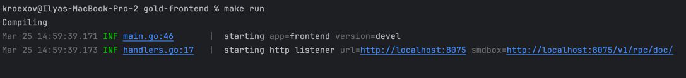
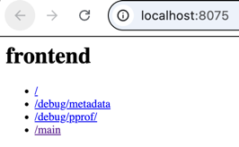
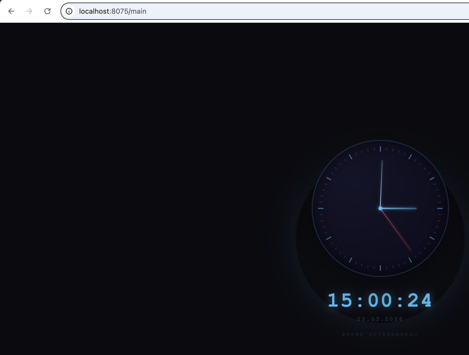

# frontend template

Run `make init` first.

1. Add your server creds to cfg/local.toml
2. Use make run & Makefile.mk to quick startup

3. You can go to server base url to see all your endpoints

4. Add new endpoins in app.registerHandlers and process them in frontend/widget.go

- optional: use make fmt lint before commit to check your code, or add them to your pre-commit hook
- optional: linters and tests are present in git, use them to check your code past-commit:

made by kroexov, origin by vmkteam